<<<<<<< HEAD
## Hi there 👋

<!--
**akashmishra18/akashmishra18** is a ✨ _special_ ✨ repository because its `README.md` (this file) appears on your GitHub profile.

Here are some ideas to get you started:

- 🔭 I’m currently working on ...
- 🌱 I’m currently learning ...
- 👯 I’m looking to collaborate on ...
- 🤔 I’m looking for help with ...
- 💬 Ask me about ...
- 📫 How to reach me: ...
- 😄 Pronouns: ...
- ⚡ Fun fact: ...
-->
=======

<!-- animated contribution graph: real data, boxes reveal cell by cell
     (regenerated daily by .github/workflows/update-profile-art.yml) -->

<h3><code>akash@github ~ $ ./contributions.sh</code></h3>

 
 

<!-- ascii portrait (left) + neofetch card (right). both svgs are 840x880,
     so equal widths give equal heights.
     portrait: python scripts/prep_photo.py <photo.jpg> && python scripts/make_ascii_svg.py
     card:     python scripts/make_info_card.py -->

<h3><code>akash@github ~ $ whoami</code></h3>

<table>
<tr>
<td valign="top"></td>
<td valign="top"></td>
</tr>
</table>

 
 

<h3><code>akash@github ~ $ ./links.sh</code></h3>

<b>Full-Stack Developer · MERN · TypeScript</b>

 

>>>>>>> 170b822 (feat: terminal-style profile README)
